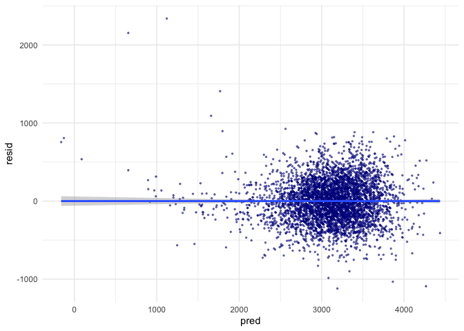
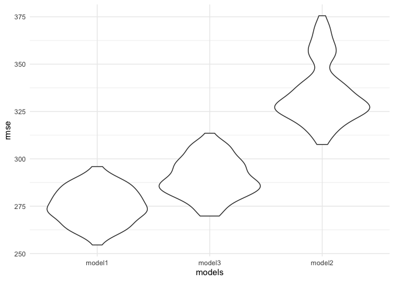
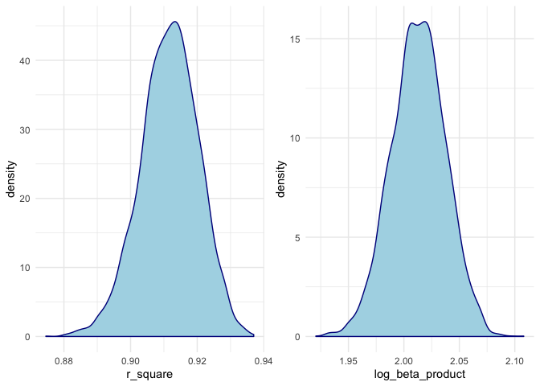

hw6
================
Yuqi Miao
11/16/2019

# Problem 1

## data cleaning

## building data driven model

### Doing SLR by making plots?

### overall regression among all variables.

    ## 
    ## Call:
    ## lm(formula = bwt ~ ., data = birthweight)
    ## 
    ## Residuals:
    ##      Min       1Q   Median       3Q      Max 
    ## -1097.68  -184.86    -3.33   173.09  2344.15 
    ## 
    ## Coefficients: (3 not defined because of singularities)
    ##                     Estimate Std. Error t value Pr(>|t|)    
    ## (Intercept)       -6265.3914   660.4011  -9.487  < 2e-16 ***
    ## babysexfemale        28.7073     8.4652   3.391 0.000702 ***
    ## bhead               130.7781     3.4523  37.881  < 2e-16 ***
    ## blength              74.9536     2.0217  37.075  < 2e-16 ***
    ## delwt                 4.1007     0.3948  10.386  < 2e-16 ***
    ## fincome               0.2898     0.1795   1.614 0.106551    
    ## fraceBlack           14.3313    46.1501   0.311 0.756168    
    ## fraceAsian           21.2361    69.2960   0.306 0.759273    
    ## fracePuerto Rican   -46.9962    44.6782  -1.052 0.292912    
    ## fraceOthers           4.2969    74.0741   0.058 0.953745    
    ## gaweeks              11.5494     1.4654   7.882 4.06e-15 ***
    ## malformpresent        9.7650    70.6259   0.138 0.890039    
    ## menarche             -3.5508     2.8951  -1.226 0.220083    
    ## mheight               9.7874    10.3116   0.949 0.342588    
    ## momage                0.7593     1.2221   0.621 0.534418    
    ## mraceBlack         -151.4354    46.0453  -3.289 0.001014 ** 
    ## mraceAsian          -91.3866    71.9190  -1.271 0.203908    
    ## mracePuerto Rican   -56.4787    45.1369  -1.251 0.210901    
    ## parity               95.5411    40.4793   2.360 0.018307 *  
    ## pnumlbw                   NA         NA      NA       NA    
    ## pnumsga                   NA         NA      NA       NA    
    ## ppbmi                 4.3538    14.8913   0.292 0.770017    
    ## ppwt                 -3.4716     2.6121  -1.329 0.183913    
    ## smoken               -4.8544     0.5871  -8.269  < 2e-16 ***
    ## wtgain                    NA         NA      NA       NA    
    ## ---
    ## Signif. codes:  0 '***' 0.001 '**' 0.01 '*' 0.05 '.' 0.1 ' ' 1
    ## 
    ## Residual standard error: 272.5 on 4320 degrees of freedom
    ## Multiple R-squared:  0.7183, Adjusted R-squared:  0.717 
    ## F-statistic: 524.6 on 21 and 4320 DF,  p-value: < 2.2e-16

Based on the overall regression, choosing the significant predictors to
build a model, which includes
`babysex`,`bhead`,`blength`,`delwt`,`gaweeks`,`mrace`,`smoke`.

### model building

    ## 
    ## Call:
    ## lm(formula = bwt ~ babysex + bhead + blength + delwt + mrace + 
    ##     gaweeks + smoken, data = .)
    ## 
    ## Residuals:
    ##      Min       1Q   Median       3Q      Max 
    ## -1120.47  -181.53    -6.01   173.39  2338.34 
    ## 
    ## Coefficients:
    ##                     Estimate Std. Error t value Pr(>|t|)    
    ## (Intercept)       -5814.2727    98.8293 -58.831  < 2e-16 ***
    ## babysexfemale        29.2229     8.4968   3.439 0.000589 ***
    ## bhead               131.8628     3.4620  38.089  < 2e-16 ***
    ## blength              75.7996     2.0220  37.488  < 2e-16 ***
    ## delwt                 2.2667     0.1962  11.553  < 2e-16 ***
    ## mraceBlack         -146.8837     9.2486 -15.882  < 2e-16 ***
    ## mracePuerto Rican  -120.0461    18.7754  -6.394 1.79e-10 ***
    ## mraceAsian          -71.6869    42.5050  -1.687 0.091762 .  
    ## gaweeks              11.8658     1.4619   8.117 6.19e-16 ***
    ## smoken               -4.7516     0.5885  -8.074 8.76e-16 ***
    ## ---
    ## Signif. codes:  0 '***' 0.001 '**' 0.01 '*' 0.05 '.' 0.1 ' ' 1
    ## 
    ## Residual standard error: 274 on 4332 degrees of freedom
    ## Multiple R-squared:  0.7144, Adjusted R-squared:  0.7138 
    ## F-statistic:  1204 on 9 and 4332 DF,  p-value: < 2.2e-16

### add the fitted value and residuals

<!-- -->

As shown in plot, the residual and fitted value has no clear linear
relationship.

## Comparing models

    ## 
    ## Call:
    ## lm(formula = bwt ~ bhead * blength * babysex, data = birthweight)
    ## 
    ## Residuals:
    ##      Min       1Q   Median       3Q      Max 
    ## -1132.99  -190.42   -10.33   178.63  2617.96 
    ## 
    ## Coefficients:
    ##                               Estimate Std. Error t value Pr(>|t|)    
    ## (Intercept)                 -7176.8170  1264.8397  -5.674 1.49e-08 ***
    ## bhead                         181.7956    38.0542   4.777 1.84e-06 ***
    ## blength                       102.1269    26.2118   3.896 9.92e-05 ***
    ## babysexfemale                6374.8684  1677.7669   3.800 0.000147 ***
    ## bhead:blength                  -0.5536     0.7802  -0.710 0.478012    
    ## bhead:babysexfemale          -198.3932    51.0917  -3.883 0.000105 ***
    ## blength:babysexfemale        -123.7729    35.1185  -3.524 0.000429 ***
    ## bhead:blength:babysexfemale     3.8781     1.0566   3.670 0.000245 ***
    ## ---
    ## Signif. codes:  0 '***' 0.001 '**' 0.01 '*' 0.05 '.' 0.1 ' ' 1
    ## 
    ## Residual standard error: 287.7 on 4334 degrees of freedom
    ## Multiple R-squared:  0.6849, Adjusted R-squared:  0.6844 
    ## F-statistic:  1346 on 7 and 4334 DF,  p-value: < 2.2e-16

### Cross validation comparision

    ## Warning in if (is.na(ordered)) {: the condition has length > 1 and only the
    ## first element will be used

    ## Warning in if (ordered) "ordered": the condition has length > 1 and only
    ## the first element will be used

<!-- -->

# Problem 2

## getting data

## Bootstrap samples

    ## Warning: unnest() has a new interface. See ?unnest for details.
    ## Try `df %>% unnest(c(results, rsquare))`, with `mutate()` if needed

<!-- -->

## counstruct CI for parameters.

|       upr |       lwr | category           |
| --------: | --------: | :----------------- |
| 1.9648667 | 2.0586196 | log\_beta\_product |
| 0.8934259 | 0.9273211 | rsquare            |

95% Confidence Interval for log\_beta\_product and r\_square
